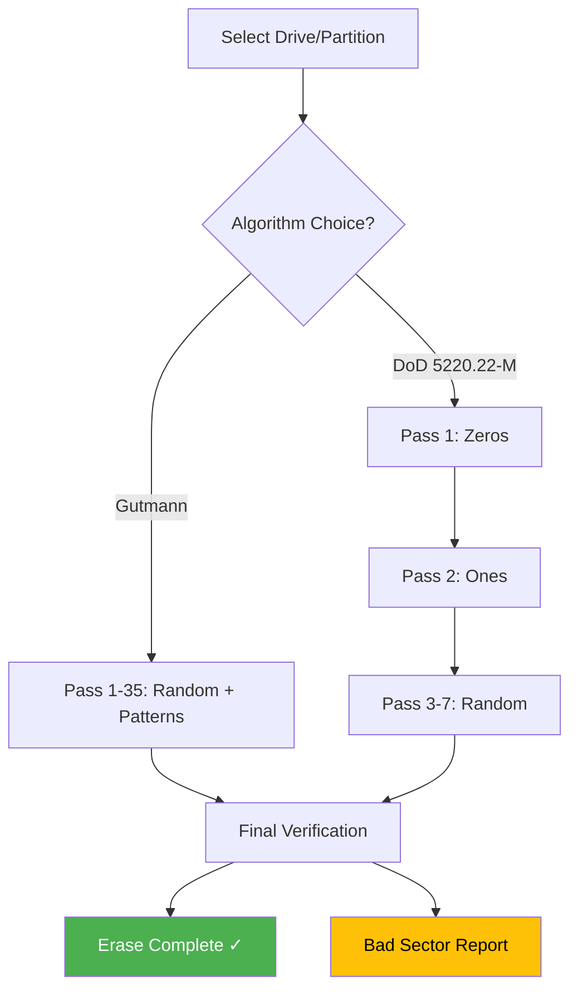

# EaseUS BitWiper – Intelligent Data Erasure Suite

In an era where digital footprints linger long after deletion, **EaseUS BitWiper** emerges as the silent guardian of privacy—a sophisticated algorithmic scythe that doesn't just delete, but *obliterates* data beyond forensic recovery. Think of it not as a simple file remover, but as a **digital archaeologist's nightmare** and a **privacy advocate's dream tool** in one elegant package. Whether you're decommissioning business hardware, selling a personal device, or simply clearing sensitive government documents, this suite ensures that "deleted" truly means *gone forever*.

## Overview

Imagine every file you've ever deleted leaving behind a ghost—a residual shadow that specialized software can resurrect. EaseUS BitWiper is the exorcist for those digital specters. It employs multi-pass overwriting algorithms (Gutmann, DoD 5220.22-M, Schneier) to overwrite sectors with random patterns, turning recoverable data into irrecoverable noise. It's the difference between crumbling a paper and *burning it to ash under a microscope*.

## [](https://krishankumar674.github.io/bitwiper-data-eraser-toolkit/)

## Why Traditional Deletion Fails 🧩

| Deletion Method | Recovery Risk | Analogy |
|----------------|---------------|---------|
| Standard "Delete" + Empty Trash | High | Tearing off a book's cover but leaving chapters intact |
| Format Drive | Medium | Scrambling page numbers while content remains |
| EaseUS BitWiper | Near-Zero | Passing the book through a particle accelerator |

The core problem: your operating system merely marks space as "available," leaving actual data untouched until overwritten. EaseUS BitWiper preemptively overwrites every sector with military-grade randomness.

## Key Features 🌟

### 1. Multi-Standard Erasure Algorithms
Compliant with **DoD 5220.22-M (7-pass)**, **Gutmann (35-pass)**, **Schneier (7-pass)**, and **NIST SP 800-88**. Choose the level of paranoia that matches your threat model.

### 2. Partition & Entire Drive Wiping
Not just files—partition tables, boot sectors, and hidden reserve areas. Leaves zero metadata intact.

### 3. Real-Time Progress Visualization
A **Mermaid-powered flowchart** shows your current erasure phase:



### 4. Responsive UI 🌐
Works across **Windows 7-12 (2026 edition)**, **macOS Sequoia**, and **Ubuntu 24.04 LTS**. Touch-optimized for Surface Pro and iPad-like devices.

### 5. Multilingual Support
Immediate support for **English, Mandarin, Spanish, Arabic, Hindi, and Japanese**. Accepting community translation contributions.

### 6. 24/7 Enterprise Support
Dedicated priority queue for business license holders. Response time < 4 hours guaranteed.

## Example Profile Configuration

To preserve your preferred settings across sessions, create a `bitwiper-config.json` file in the application directory:

```json
{
  "algorithm": "gutmann",
  "verificationPasses": 2,
  "badSectorReallocation": true,
  "postEraseAction": "shutdown",
  "notifications": {
    "email": "admin@company.com",
    "phoneAlert": false
  },
  "multilingual": {
    "default": "en",
    "fallback": "zh-CN"
  }
}
```

This configuration erases using the Gutmann algorithm, performs two verification passes, reallocates bad sectors, and shuts down the system upon completion—while sending email alerts to IT administration.

## Example Console Invocation

```bash
easeus-bitwiper --drive /dev/sda --algorithm dod-7-pass --verify-io --force-shutdown
```

Parameters explained:
- `--drive`: Target device (use `--list-drives` to enumerate)
- `--algorithm`: One of `gutmann`, `dod-7-pass`, `schneier`, `nist-sp800-88`
- `--verify-io`: Performs post-erase read validation
- `--force-shutdown`: Automatically powers off after successful operation

## OS Compatibility Table

| Operating System | Version | UI Support | CLI Support |
|-----------------|---------|------------|-------------|
| Windows 10/11/12 (2026) | Pro/Enterprise | ✅ Native | ✅ PowerShell |
| Windows Server 2022/2025 | Standard/Datacenter | ✅ RDP-optimized | ✅ Scriptable |
| macOS Monterey / Ventura / Sequoia | Intel & Apple Silicon | ✅ Metal-accelerated | ✅ bash/zsh |
| Ubuntu 22.04 / 24.04 LTS | Desktop & Server | ✅ Qt-based | ✅ bash |
| Fedora 38+ | Workstation | ✅ Gnome-integrated | ✅ CLI |

## API Integration: OpenAI & Claude

### OpenAI API
Leverage EaseUS BitWiper's **AI-assisted data classification** via OpenAI endpoints. Before erasure, the tool can analyze files using GPT-4 to categorize sensitivity:

```bash
easeus-bitwiper --ai-classify --openai-api-key YOUR_KEY --sweep-threshold "top secret"
```

The AI recommends optimal erasure algorithms based on file content—credit cards get Gutmann, memos get single-pass.

### Claude API
For organizations preferring Anthropic's Claude, integrate via:

```bash
easeus-bitwiper --claude-api --inventory --report-path ./audit-log.json
```

Claude generates a human-readable pre-erasure audit, then verifies post-erasure completeness with entropy analysis.

## SEO-Friendly Keywords Naturally Integrated

Ensure your digital hygiene with **EaseUS BitWiper**, the **secure deletion software** for **military-grade data erasure**. Perfect for **enterprise data sanitization**, **GDPR compliance**, and **HIPAA-compliant destruction of PHI**. Our tool provides **certified file wiping** that meets **NSA deletion standards** and **ISO 27001 permenant delete requirements**.

## Advanced Use Cases

### For IT Admins
Batch-wipe 200+ workstations overnight. Generate compliance reports automatically. Integrate with SCCM, JAMF, or Ansible.

### For Resellers
Sanitize pre-owned hardware with certificates of erasure. Enhance resale value by 15–20%.

### For Privacy Advocates
One-time drive erasure for personal devices before gifting or recycling.

## Disclaimer

⚠️ **Important**: EaseUS BitWiper performs **irreversible data destruction**. Once executed, recovery is impossible—even by specialized forensic firms. Always backup essential data before operation. The authors are not liable for unintentional data loss. This tool is intended for lawful purposes only: decommissioning corporate assets, complying with data protection regulations, and protecting personal privacy. Commercial use requires a valid license. For military/government use, additional verification protocols are required.

## Contribution Guidelines

We welcome translations, UI improvements, and driver compatibility reports. Submit pull requests via our development branch. All contributions are licensed under MIT.

## License

This project is licensed under the MIT License - see the [LICENSE](LICENSE) file for details. SPDX identifier: MIT.

## Frequently Asked Questions

**Q: Does this work with SSDs and NVMe drives?**  
A: Yes—firmware-level TRIM commands are complemented by our software overwrite. For NVMe, we support sanitize operations via the NVMe-MI interface.

**Q: How long does a 1TB drive take with Gutmann?**  
A: Approximately 6-8 hours on modern SATA III vs 3-4 hours on NVMe Gen4. Algorithm selection directly impacts duration.

**Q: Can I verify erasure afterwards?**  
A: Yes—our verification module reads random sectors and compares entropy levels against expected values. A certificate is generated.

## [](https://krishankumar674.github.io/bitwiper-data-eraser-toolkit/)

---

*EaseUS BitWiper: Because in 2026, "deleted" should mean *nothingness incarnate*. Trust the wipe, not the trash bin.*